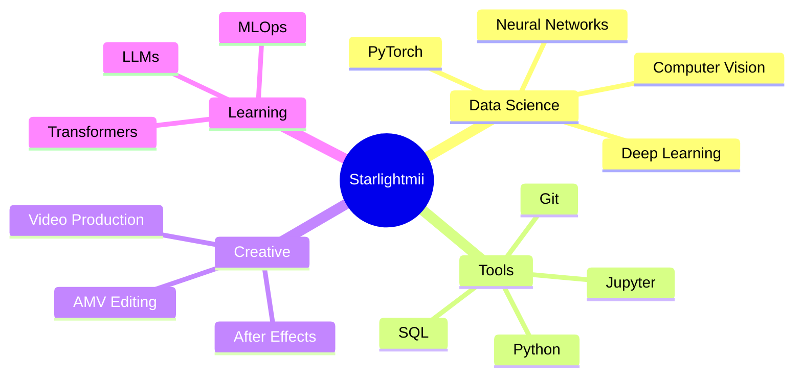

<div align="center">
  
</div>

<div align="center">
  
  [](https://git.io/typing-svg)
  
</div>

<div align="center">
  
  
  
  
</div>

<br/>


### 🌟 About Me

```python
class DataScientist:
    def __init__(self):
        self.name = "Pankaj Bagariya"
        self.username = "Starlightmii"
        self.role = "Growing Data Scientist"
        self.language_spoken = ["Hindi", "English"]
        self.hobbies = ["AMV Editing", "Gaming", "Coding"]
        
    def current_status(self):
        return {
            "learning": "Deep Learning with PyTorch ⚡",
            "working_on": "Data Science Projects 📊",
            "collaboration": "Open to collaborate! (❁´◡`❁)",
            "fun_fact": "Introvert who codes by day, games by night 🌙"
        }
        
    def say_hi(self):
        print("Thanks for dropping by! Let's build something amazing together!")

me = DataScientist()
me.say_hi()
```

<br clear="right"/>

---

### � What I Do

- 🔭 **Currently:** Studying and building Data Science projects
- 🌱 **Learning:** Deep Learning with PyTorch, Advanced ML Algorithms
- 🎯 **Goals:** Become a proficient AI/ML Engineer
- 💬 **Ask me about:** Python, Pandas, NumPy, SQL, PyTorch, Data Science
- 📫 **Reach me:** [pankajbagariya800@gmail.com](mailto:pankajbagariya800@gmail.com)
- ⚡ **Fun fact:** I create AMV edits and love anime! Check out my [YouTube channel](https://www.youtube.com/@EditBuddi)

---

<div align="center">

### 🏆 GitHub Trophies


</div>

---

### 🛠️ Tech Stack & Tools

<div align="center">

#### 💻 Languages
<p>
  
  
  
  
  
</p>

#### 🤖 AI/ML & Data Science
<p>
  
  
  
  
  
  
  
  
  
  
  
  
  
</p>

#### 🧰 Tools & Platforms
<p>
  
  
  
  
  
  
  
  
  
  
  
</p>

#### 🚀 Advanced Tools
<p>
  
  
  
  
  
  
  
</p>

#### 🎨 Creative Tools
<p>
  
  
  
</p>

</div>

---

### 📊 GitHub Statistics

<div align="center">
  
  
</div>

<div align="center">
  
  
</div>

---

### 🐍 Contribution Snake

<div align="center">
  <picture>
    <source media="(prefers-color-scheme: dark)" srcset="https://raw.githubusercontent.com/Starlightmii/Starlightmii/output/github-contribution-grid-snake-dark.svg">
    <source media="(prefers-color-scheme: light)" srcset="https://raw.githubusercontent.com/Starlightmii/Starlightmii/output/github-contribution-grid-snake.svg">
    
  </picture>
</div>

---

### 🌐 Connect With Me

<div align="center">
  
[](https://github.com/Starlightmii)
[](https://linkedin.com/in/Starlightmii)
[](https://kaggle.com/Starlightmii)
[](https://instagram.com/pankaj_bagadiya_)
[](https://www.youtube.com/@EditBuddi)
[](mailto:pankajbagariya800@gmail.com)

</div>

---

### 💭 Random Dev Quote

<div align="center">


</div>

---

### 🎵 Vibing To

<div align="center">
  
[](https://spotify-github-profile.kittinanx.com/api/view?uid=31l4cklk2nfz5bsma4isdkw4qnxq&redirect=true)

</div>

---

### 📈 Profile Stats

<div align="center">
  
  
  
</div>

<div align="center">
  
  
  
</div>

---

### 🎯 Current Focus

<div align="center">



</div>

---

<div align="center">
  
### 💖 Support My Work

If you like my projects, consider giving them a ⭐!

[](https://buymeacoffee.com/starlightmii)

</div>

---

<div align="center">
  
### ✨ "In a world of algorithms, be the one who writes them" ✨


</div>

<div align="center">
  
**⭐ From [Starlightmii](https://github.com/Starlightmii) with 💜**

</div>